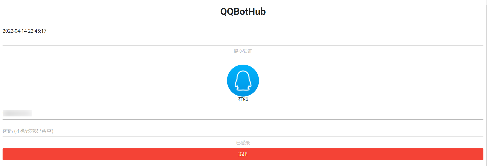

<h1 align="center">QQBotHub</h1>

> 琪琪 机器人 平台 | 日常生活学习工作 工具集 | QQ、Telegram、微信、钉钉、浏览器自动化、打卡

[]()
[](https://github.com/yiyungent/QQBotHub/blob/master/LICENSE)
[](https://t.me/xx_dev_group)
[](https://jq.qq.com/?_wv=1027&k=q5R82fYN)
<!--  -->
[](https://hub.docker.com/r/yiyungent/qqbothub)
[](https://hub.docker.com/r/yiyungent/qqbothub)
[](https://github.com/yiyungent/QQBotHub/actions/workflows/docker-push-qqbothub-release.yml)
[](https://hanadigital.github.io/grev/?user=yiyungent&repo=QQBotHub)


## Introduce

琪琪 机器人 平台 | 日常生活学习工作 工具集 | QQ、Telegram、微信、钉钉、浏览器自动化、打卡

- **Web 可视化** - 无需再在 Console 上操作, 轻松上手
- **插件化架构** - 轻松使用插件扩展
- **多平台多架构** - win,linux,osx,amd,arm 均可

> **注意** : 本项目仅供学习使用, 所有第三方插件与本项目无关

> **通知:**
> 最新版 (QQBotHub-**v0.5.4** +)  已修复 由 [KonataDev/Konata.Core](https://github.com/KonataDev/Konata.Core) 导致 **QQ无法登录的问题**, 你需要更新 `QQBotHub` 与 `ConsoleApp`  


## 功能

- [x] 在线 QQ 登录
- [x] **其它大部分功能由 插件提供**
- [x] 本仓库 维护的 官方插件
  - [QQHelloWorldPlugin](https://github.com/yiyungent/QQBotHub/releases?q=QQHelloWorldPlugin&expanded=true)
    - [x] 复读好友私聊
    - [x] 上下线通知 设置 里的 AdminQQ
  - [MoLiPlugin](https://github.com/yiyungent/QQBotHub/releases?q=MoLiPlugin&expanded=true)
    - [x] 对接 [茉莉机器人 API](https://mlyai.com?from=GitHub-QQBotHub)
      - 自定义知识库, 各种娱乐功能
    - [x] 设置 机器人聊天群, 好友
    - [x] `@机器人` / `聊天前缀`
    - [x] 免费API调用次数：500次/天
      - 专属8折优惠码：`qqbothub`
  - [QQChannelPlugin](https://github.com/yiyungent/QQBotHub/releases?q=QQChannelPlugin&expanded=true)
    - [x] QQ频道 基础插件, 可依赖本插件开发相关插件, 提供事件派发, 机器人管理
    - [x] 订阅频道消息/私信 
    - [x] 多频道机器人管理
    - [x] 沙盒模式
    - [x] 演示模式
  - [MoLi4QQChannelPlugin](https://github.com/yiyungent/QQBotHub/releases?q=MoLi4QQChannelPlugin&expanded=true)
    - [x] 专为 QQ 频道, 支持多个机器人, **启用前需保证 QQChannelPlugin 处于已启用状态** 
    - [x] 对接 [茉莉机器人 API](https://mlyai.com?from=GitHub-QQBotHub)
      - 自定义知识库, 各种娱乐功能
    - [x] `@机器人` / `聊天前缀`
  - [QQStatPlugin](https://github.com/yiyungent/QQBotHub/releases?q=QQStatPlugin&expanded=true)
    - [x] 收集群聊消息 
    - [x] 下载 群聊 数据库
    - [x] `#日历`
    - [x] `#折线`
  - [BackupPlugin](https://github.com/yiyungent/QQBotHub/releases?q=BackupPlugin&expanded=true) 
    - [x] 定时 自动 备份 插件数据
    - [x] 将 备份文件 发送到 Telegram 
    - 备份时消耗较大, 建议 搭配 `AutoLoginPlugin` 使用, 防止备份途中 意外掉线
  - [AutoLoginPlugin](https://github.com/yiyungent/QQBotHub/releases?q=AutoLoginPlugin&expanded=true) 
    - [x] 定时 检测在线状态 (频率:1分钟)
    - [x] 当由于异常离线后, 自动利用登录成功的数据 重新登录
    - [x] 重新登录成功后, 通知 `AdminQQ`
  - [QQNotePlugin](https://github.com/yiyungent/QQBotHub/releases?q=QQNotePlugin&expanded=true) 
    - [x] 利用 QQ 写笔记 (随笔/零碎知识点)
      - 笔记写入 GitHub 指定仓库的指定文件中
  - [ZhiDaoPlugin](https://github.com/yiyungent/QQBotHub/releases?q=ZhiDaoPlugin&expanded=true) 
    - [x] 自定义问答
      - [x] 群主/管理员/AdminQQ 自定义问答
      - [x] 分群自定义问答    
      - [x] 关键词自动回复 

## Screenshots




### [QQStatPlugin](https://github.com/yiyungent/QQBotHub/releases?q=QQStatPlugin&expanded=true)


## Quick Start

### 部署

> `PluginCore Admin 用户名` 与 `PluginCore Admin 密码` 为你自己设置的后台登录用户名与密码, 随意设置即可, 自己记住就行

#### 方式1：原生部署（适合小白）

选择  [Releases - QQBotHub, 点我下载](https://github.com/yiyungent/QQBotHub/releases?q=QQBotHub&expanded=true)
找到并下载 QQBotHub 相应平台压缩包，
windows系统 的 vps，下载 windows-64版本 的即可，
解压里面有exe，运行它即可（无需再安装其它任何运行库），
黑窗口中会显示一个url地址，复制到浏览器中打开即可，
保持此黑窗口在后台运行，机器人就不会掉线

#### 方式2: 使用 Railway 免费 一键部署 

> - 点击下方按钮 一键部署        
> - 免费注册, 无需信用卡验证      
> - Railway 每月有 `$5.00` 免费额度, 若只跑本项目完全够用 (应该说绰绰有余)

[](https://railway.app/new/template/A3JY-J?referralCode=8eKBDA)


##### Railway 环境变量

| 环境变量名称                | 必填 | 备注                    |
| --------------------------- | ---- | ----------------------- |
| `PLUGINCORE_ADMIN_USERNAME` | √    | PluginCore Admin 用户名 |
| `PLUGINCORE_ADMIN_PASSWORD` | √    | PluginCore Admin 密码   |


> 注意:    
> - Railway 修改环境变量 会 触发 重新 Deploy   
> - Railway 重新 Deploy 后会删除数据, 你安装的所有插件及数据都将清空。

#### 方式3: 使用 Heroku 免费 一键部署 

注意：此种方式可能无法QQ登录

> - 点击下方按钮 一键部署       
> - 免费注册, 无需信用卡验证
> - Heroku 每月有免费时长 500小时, 若使用信用卡验证, 可提升到 免费 1000小时      
> - Heroku 应用一段时间不访问会自动休眠, 因此为了保证存活, 请使用第三方监控保活, 例如: [UptimeRobot: 免费网站监控服务](https://uptimerobot.com/)   

[](https://heroku.com/deploy?template=https://github.com/yiyungent/QQBotHub)


##### Heroku 环境变量

| 环境变量名称                | 必填 | 备注                    |
| --------------------------- | ---- | ----------------------- |
| `PLUGINCORE_ADMIN_USERNAME` | √    | PluginCore Admin 用户名 |
| `PLUGINCORE_ADMIN_PASSWORD` | √    | PluginCore Admin 密码   |


#### 方式4: 使用 Docker

```bash
docker run -d -p 5004:80 -e ASPNETCORE_URLS="http://*:80" -e ASPNETCORE_ENVIRONMENT="Production" -e TZ="Asia/Shanghai"  --name qqbothub yiyungent/qqbothub
```

```bash
# 可选, 进入容器 管理, 例如修改 /app/App_Data/PluginCore.Config.json 中的 PluginCore Admin 用户名与密码
docker exec -it qqbothub bash
```

> 现在访问: <http://localhost:5004/PluginCore/Admin>


### QQ 登录

> 部署完成后
> > ⭐⭐⭐⭐ 一定要先登录 `PluginCore Admin`, 因为 `QQ登录页面` 与 `PluginCore Admin` 使用相同权限⭐⭐⭐⭐      
> > 访问 **401** 说明你没有登录 <https://your-domain/PluginCore/Admin>      
> 1. 访问: <https://your-domain/PluginCore/Admin>  进入 `PluginCore Admin`
> 2. 访问: <https://your-domain> 进行 QQ机器人 登录

> 若为 `短信验证` , 则直接输入收到的验证码, 点击 `提交验证` 即可

> 若为 `滑动验证` , 则 `点击前往验证`, 浏览器在 `滑动验证` 页面 按 `F12`, 再选择 `Network`, 通过滑动验证后, 复制 `ticket` 如下 (不要包括双引号), 将 `ticket` 粘贴到输入框, 点击 `提交验证` 即可


> 注意验证不要等待太久, 否则尝试刷新登录页面 以重新登录及获取新验证


> **注意**    
> ⭐⭐⭐⭐当 **无法登录** 时⭐⭐⭐⭐
> 
> - 当 `滑动验证` `验证通过` 后, 等待一会 , 还是 `无法进入已登录状态`     
>   
> 可 下载 [Releases - ConsoleApp - Assets](https://github.com/yiyungent/QQBotHub/releases?q=ConsoleApp&expanded=true) 在本地登录成功后,    
> 获取 **BotKeyStore.json** 后, 在登录页面使用 **配置** 方式登录
> 
> > - 大部分人电脑为 `Windows 64 位`, 点击 **ConsoleApp-win-x64.zip** 下载即可, 下载到本地解压, 双击 **ConsoleApp.exe**
> > - 运行 `ConsoleApp.exe` 会自动给出输入提示, 按提示操作即可       
> > - 运行 `ConsoleApp.exe` 无需额外安装 `.NET SDK 或 Runtime`, 程序已打包


### 插件管理

访问: <https://your-domain/PluginCore/Admin>  进入 `PluginCore Admin`

> 插件:   
> 下载插件包, 
> > 插件包下载见 [Release](https://github.com/yiyungent/QQBotHub/releases) , 
> > 直接插件上传 下载的 `QQHelloWorldPlugin-net6.0.zip` 即可    
> 
> 然后直接 `上传 -> 安装 -> 文档 -> 设置 -> 启用 -> 文档` 即可


## 更新 QQBotHub

> 查看最新版 [Releases - QQBotHub](https://github.com/yiyungent/QQBotHub/releases?q=QQBotHub&expanded=true)


> 若你使用 `Railway` 一键部署,         
> 只需要修改 `Railway` 创建的仓库 (例如: `QQBotHub`) 里的 `Dockerfile` 文件里的 `yiyungent/qqbothub:v0.5.2` , 更新最后的版本号 `v0.5.2` 到最新版即可


> **注意:**    
> 请更新前导出插件数据, `QQStatPlugin` 支持下载数据库到本地, 然后下载最新插件包, 解压, 将数据库文件替换为你导出的数据库文件, 然后在有 `QQStatPlugin.sqlite` 的路径下打包所有文件 为 zip, 上传插件即可           
> `插件设置` 可以通过保持打开插件设置页面的方式, 重新安装插件后, 再在此页面点击保存


> 一些更新 docker qqbothub 可能需要用到的命令

```bash
# docker-data 位置用于保存当前容器数据
mkdir -r docker-data/App_Data/
mkdir -r docker-data/Plugins/
mkdir -r docker-data/Plugins_wwwroot/
# 保存当前数据
docker cp qqbothub:/app/App_Data/PluginCore.Config.json docker-data/App_Data/PluginCore.Config.json
docker cp qqbothub:/app/App_Data/plugin.config.json docker-data/App_Data/plugin.config.json
docker cp qqbothub:/app/Plugins/ docker-data/
docker cp qqbothub:/app/Plugins_wwwroot/ docker-data/

# 移除当前
docker stop qqbothub
docker rm qqbothub
docker rmi yiyungent/qqbothub

# 获取最新
docker pull yiyungent/qqbothub:latest
docker run -d -p 53213:80 -e ASPNETCORE_URLS="http://*:80" -e ASPNETCORE_ENVIRONMENT="Production" -e TZ="Asia/Shanghai"  --name qqbothub yiyungent/qqbothub

# 这里我将原本备份的数据保存到了这个路径, 进入这个路径, 将备份数据覆盖到 docker 容器中
cd docker-data

docker cp App_Data/PluginCore.Config.json qqbothub:/app/App_Data/PluginCore.Config.json
docker cp App_Data/plugin.config.json qqbothub:/app/App_Data/plugin.config.json
docker cp Plugins/ qqbothub:/app/
docker cp Plugins_wwwroot/ qqbothub:/app/

# 重启容器
docker restart qqbothub
```


## 插件开发

> 注意:  
> 所有纯基于 `PluginCore.IPlugins` 开发的插件都通用,   
> 下载插件包, 然后 `上传 -> 安装 -> 设置 -> 启用` 即可


> 插件开发 可参考:   
> - [插件开发 | PluginCore](https://moeci.com/PluginCore/zh/PluginDev/Guide/)      
> - **建议** 参考: [./plugins/QQHelloWorldPlugin](https://github.com/yiyungent/QQBotHub/tree/main/plugins/QQHelloWorldPlugin)

> QQBotHub 插件开发包  
> 插件开发包中已包含:   
> - `Konata.Core`
> - `PluginCore.IPlugins.AspNetCore`

```powershell
dotnet add package QQBotHub.Sdk
```

> **注意**:   
> - 本项目目前直接使用的 `PluginCore` 插件框架, 插件采用激发式, 插件工作完成后, 实例会立即销毁, 无法常驻后台
> - 若需要定时任务, 可以使用 `ITimeJobPlugin`, 可见 `PluginCore` 的文档    
> - 由于 QQBot 本身为常驻, 因此需额外注意 `IPluginFinder` 的服务的生命周期/范围, 这点和在 `ASP.NET Core` 的 `Controller` 中 直接使用不同

## 相关项目

- [KonataDev/Konata.Core](https://github.com/KonataDev/Konata.Core) - QQ Android 协议核心库
- [yiyungent/PluginCore](https://github.com/yiyungent/PluginCore) - 插件系统

### 社区插件

> 欢迎 Pull Request !

- [SweelLong/AntiRecall: 这是基于QQBotHub的开源插件，主要功能是防止消息撤回。](https://github.com/SweelLong/AntiRecall)       
- [SweelLong/RandomImage: 这是基于QQBotHub的开源插件，主要功能是发送随机图片。](https://github.com/SweelLong/RandomImage)       


## Donate

QQBotHub is an GPL-3.0 licensed open source project and completely free to use. However, the amount of effort needed to maintain and develop new features for the project is not sustainable without proper financial backing.

We accept donations through these channels:

- <a href="https://afdian.net/@yiyun" target="_blank">爱发电</a> (￥5.00 起)
- <a href="https://dun.mianbaoduo.com/@yiyun" target="_blank">面包多</a> (￥1.00 起)

## Author

- QQBotHub 主程序 `GPL-3.0`
- QQBotHub.Sdk `GPL-3.0`
- QQHelloWorldPlugin `GPL-3.0`
- MoLiPlugin `GPL-3.0`
- QQStatPlugin `GPL-3.0`
- BackupPlugin `MIT`
- AutoLoginPlugin `GPL-3.0`
- QQNotePlugin `GPL-3.0`
- ZhiDaoPlugin `GPL-3.0`
- WebMonitorPlugin `Apache-2.0`

**QQBotHub** © [yiyun](https://github.com/yiyungent), Released under the [GPL-3.0](./LICENSE) License.<br>
Authored and maintained by yiyun with help from contributors ([list](https://github.com/yiyungent/QQBotHub/contributors)).

> GitHub [@yiyungent](https://github.com/yiyungent) Gitee [@yiyungent](https://gitee.com/yiyungent)

